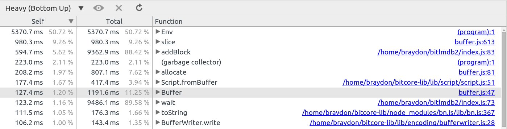
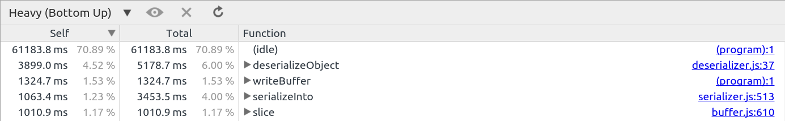

# Bitcore Storage Tests

Keeping a database of bitcoin address summaries with balance and txids will improve read performance. Being able to read from multiple processes will also help read performance for better CPU utilization. Doing this requires calculating the balance of addresses in advance, and that requires retrieving previous output information during the initial synchronization. Three alternatives were explored as options for getting this information, in addition to additional query tests.

## Multi-address Transaction History Queries

### Question

What is best method to model data to query for transaction history for multiple addresses?

### Hypothesis

Keeping a single key/value with an array of txids should have considerable read performance benefits for queries upon multiple addresses.

### Tests and Analysis

1. **LevelDB concatenation** ([code](https://github.com/braydonf/bitcore-storage-tests/blob/master/leveldb/multi-txids.js)): Key/values are both used with a single key that keeps track of all txids. When updating these records a read-modify-write operation is needed (see [txids-append.js](https://github.com/braydonf/bitcore-storage-tests/blob/master/leveldb/txids-append.js) and [txids-keys.js](https://github.com/braydonf/bitcore-storage-tests/blob/master/leveldb/txids-keys.js) for write performace). The key/values have the form: `ripemd160 address hash (20bytes), address type (1byte) -> [height (4bytes), txid(32 bytes)]`.
2. **LevelDB key streaming** ([code](https://github.com/braydonf/bitcore-storage-tests/blob/master/leveldb/multi-txids-stream.js)): Keys are used exclusively to record each instance of a transaction for an address. The advantage is the write operations do not need to read-modify-write operation (not optimized). The format of the key is: `ripemd160 address hash (20bytes), address type (1byte), height (4bytes), txid (32bytes)`. Since this is using LevelDB the height and txids are used as part of the key because there can not be multiple values as with LMDB.
3. **MongoDB multi-document** ([code](https://github.com/braydonf/bitcore-storage-tests/blob/master/mongodb/multi-txids.js)): Each transaction is recorded as a document with key/values for address, txid and height. An index is created for address and height.
4. **MongoDB single-document** ([code](https://github.com/braydonf/bitcore-storage-tests/blob/master/mongodb/multi-txids-single.js)): Each address has a document that includes all txids for the address. The document has an address and txids field, with an address index. The txids all have an txid and height property.

Timing results for **10,000 addresses** with **2 txids each**:

1. 157 milliseconds
2. 1,524 milliseconds
3. 255 milliseconds
4. 286 milliseconds

Timing results for **100,000 addresses** with **2 txids each**:

1. 1,784 milliseconds
2. 15,191 milliseconds
3. 2,399 milliseconds
4. 2,752 milliseconds

These results show that with LevelDB a single key/value updated with txids for an address is 800% faster over streaming txids from keys *(the currently implemented method)*. However only a 130% improvement in comparison with MongoDB documents with indexes for address and height.

## Experiment with Node.js Clustering LMDB Storage

### Question

What is the performance of querying the txids sorted by block height involving 2,100 addresses in a cluster?

### Hypothesis

Being able to query LMDB database from multiple processes plus using LMDB cursors should improve query speeds.

### Tests and Analysis

The [code in this repository](https://github.com/braydonf/bitcore-storage-tests/blob/master/lmdb/cluster.js) tests LMDB for querying and merging multiple results. The database uses duplicate sorted fixed values. The key is the address and the value the txid and height. Furthermore multiple read only transactions are used inside of a cluster of child processes sharing the same LMDB environment. For the tests 8 child processes where started. Around 2,100 addresses are generated and the database records two txids per address, is this is the average for an HD wallet. **The time on average for a single query was around 200ms.** Merge sorting was the most expensive part of the operation, without sorting the response time was under 100ms. With 200 concurrent requests the response times were around 2.5 seconds.

These results show that query performance has been improved by around 15 times in addition to improve concurrency.

## Experiment with LMDB Storage

### Question

What is the performance of storing/retrieving unspent output information with [LMDB](https://github.com/LMDB/lmdb) while syncing to calculate a running record of address balances with txids?

### Hypothesis

Recording output information with LMDB while syncing should result in comparable speeds (less than 24 hours) while also being able to calculate a running balance and record of txids. The [improved read speeds](http://symas.com/mdb/microbench/) should be a benefit for updating existing information such as an address summary include balance and txids.

### Tests and Analysis

The [code in this repository](https://github.com/braydonf/bitcore-storage-tests/blob/master/lmdb/index.js) is a test to see how well it will perform. These tests used **node-lmdb** ([venemo/node-lmdb#57df990a88f507cdbe866e2aa2ca63127b6b3d06](https://github.com/Venemo/node-lmdb/tree/57df990a88f507cdbe866e2aa2ca63127b6b3d06)). Two databases were used, one for previous output information and the other for address summaries. The previous output database key was `prevTxId` and `outputIndex`, the value satoshis and address hash and type. Storing the address hash and type means that the script doesn't need to be parsed again later. These values are later used to update the address summary. The address summary database uses key of address hash and type with value of the balance followed by all of the txids.

**The sync speeds start off at 3035 blocks per second at height 30350, 20 bps at height 185120, 5 bps at height 228624 and 2 bps at height 288636.** The memory usage of Bitcore at 228624 was around 11g, and the CPU around 50% to 75%. Committing the environment every 200 blocks or 1 every second improved the speed improve the performance. Retrieving previous output information performance was excellent, and updating address summaries appeared to be the most expensive operation that looks to have been improved by using the `dupSort` option. Due to there being low CPU usage there could be other optimizations made to improve overall performance. There may also be memory optimizations that can be made as the performance can be **22.3 blocks per second at block height 324,249** after a restart, which then slowly falls uncorrelated with increase of transactions per block.

These results have shown that using LMDB can improve the performance to keep an address summary with balance and txids and is a great option for a backend for keeping a bitcoin address index.

## Experiment with LMDB/Bitcoin Storage

### Question

What is the performance with syncing blockchain with LMDB with a running record of address balances with txids and querying transaction data from bitcoind?

### Hypothesis

The read performance of LMDB [from benchmarks](https://github.com/wiredtiger/leveldb_wt/tree/master/doc/bench) have been nearly twice as fast as LevelDB, with comparable performance for write speeds. LMDB also has the benefit of being able to be shared across processes on the same host for improve read performance. Syncing times should be comparable to current times with the additional ability to retrieve previous information necessary for updating records for a running address balance and associated txids.

### Tests and Analysis

The [code in this repository](https://github.com/braydonf/bitcore-storage-tests/blob/master/lmdb-bitcoin/index.js) is a test to see how well it will perform. Two databases were created one for address balances and another for address txids. The key for both was the same using the hash (ripemd160) and type (p2pkh and p2sh). The node-lmdb library ([venemo/node-lmdb#57df990a88f507cdbe866e2aa2ca63127b6b3d06](https://github.com/Venemo/node-lmdb/tree/57df990a88f507cdbe866e2aa2ca63127b6b3d06)) was used for these tests. The txids are stored by appending to the end of the value and the balance by subtracting and adding to the previous value. Previous output information was retrieved using [bitcoind Node.js bindings](https://github.com/bitpay/bitcore-node/blob/462e4e3cdd15e5d59812e089eb88f6ce8e45066b/src/libbitcoind.cc#L1016) with the `getTransaction` method.

The sync times began positively at 1,460 blocks per second at height 39,317. This decreased to 48.1 blocks per second at height 12,2992, 17.1 bps at 139,136 block height, and 0.5 bps at 192,209 block height. The transaction volume around these times increases and contributes to the values. The syncing was canceled as the time remaining was calculated to be more than 3 days (and there are more transactions per block later). The memory usage of Bitcore was around 4.777g at 148,971 while syncing. A CPU profile at block height 193,000 showed that `getTransaction` accounted for 34% of the time with 23% consumed by garbage collection.

Retrieving and updating values for the balance and txids didn't account for a significant amount of the CPU time and therefore it's plausible that LMDB read performance is helping sync times when updating existing values. However to determine that this is true, it would be useful to also store previous output information with LMDB.

## Experiment with MongoDB Storage

### Question

What is the performance with syncing blockchain with MongoDB with all bitcoin transaction data and a running record of address balances with txids?

### Hypothesis

Storing each transaction in MongoDB may provide faster retrieval of previous output information needed for calculating the balance of each address when processing blocks and recording txids per address. Furthermore using mongo queries to update records may also benefit performance with reading and updating existing records.

### Tests and Analysis

The [code in this repository](https://github.com/braydonf/bitcore-storage-tests/blob/master/mongodb/index.js) is a test to see how well syncing will perform. Two collections have been created in MongoDB, one for storing all transactions and another for address summaries. The transaction collection is indexed by `_id` which is the transaction hash. The address summary collection is indexed by hash (ripemd160) and type (p2sh or p2pkh). The address summary collection is updated using `$inc`, `$push` and `$pull` query methods that passes some of the work over to MongoDB. All previous outputs are queried for transaction inputs so that a more accurate index can be created and the balance calculated, the transaction collection is used for this purpose. Batch or bulk writing was not used for this test. MongoDB version 2.6.11 was used and Node.js 4.2.1. Syncing was performed against an already downloaded mainnet bitcoin block chain.

Initially the syncing times were around 247 blocks per second and then falling to 22 at block height 114,000, 2 at 167,000 and 0.1 at 181,000. At this time the syncing process was canceled as the time remaining would be calculated to exceed more than 3 days. The memory usage of MongoDB was quite high during the syncing and up to 7.904g at block height 180,000, however after a restart this usage was lower at 3.383g at 180,000. The CPU usage was typically around 50% between MongoDB and Bitcore, and towards the end it was common that MongoDB was doing most of the CPU intensive tasks with Bitcore spending 70% of the time idle, and 6% deserializing transactions from MongoDB.

There is no evidence that supports that storing transaction data in MongoDB improves the performance of retrieving previous output information, or that there are performance benefits with using MongoDB queries to update records.
